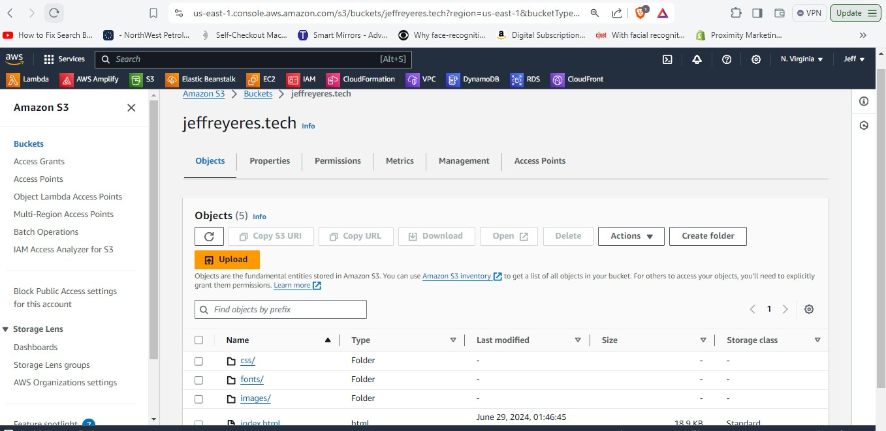
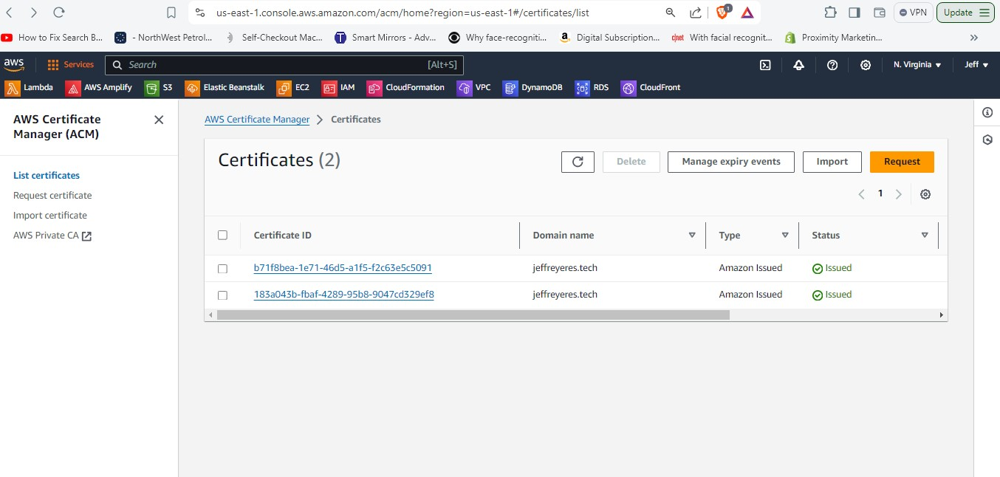
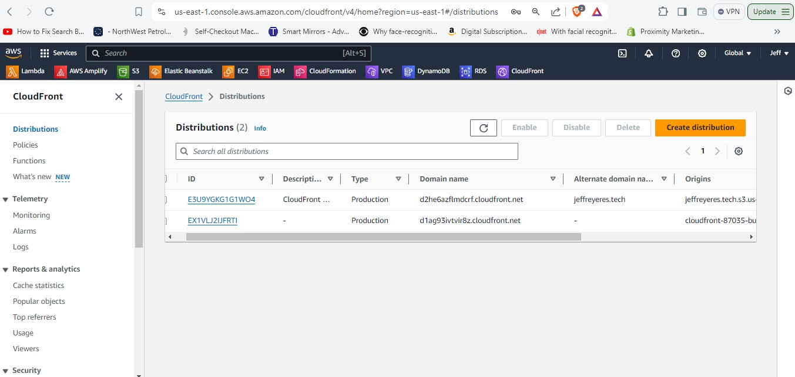
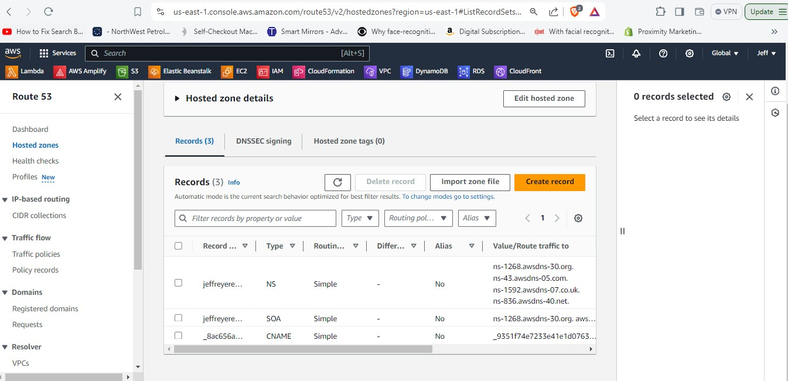
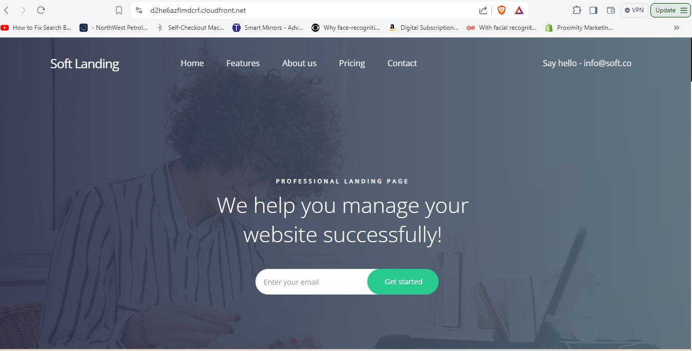
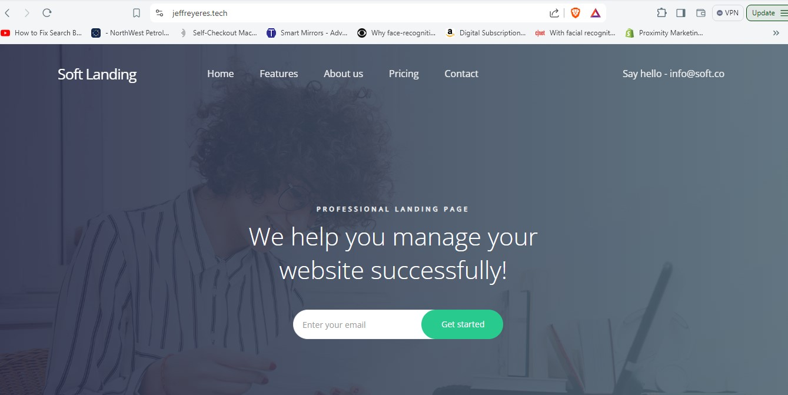
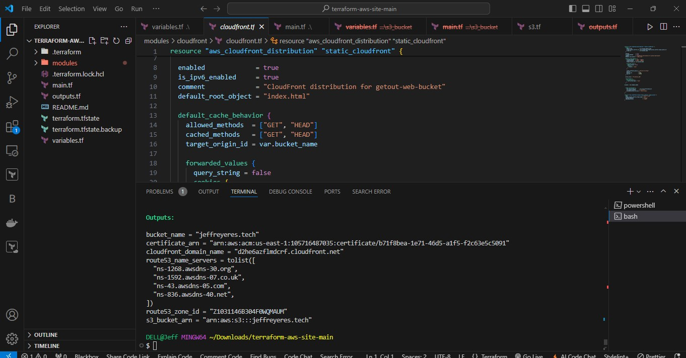

# Terraform Static website with custom domain name
## Automate website hosting on AWS using Terraform with S3, CloudFront, Route 53, and ACM Certificate

## S3_Bucket
### This is the S3 bucket after deploying

## Certificate 
### This is the Certificate after deploying

## Cloudfront
### This is the Cloudfront distribution after deploying

## Route53
### This is the hosted zones in route53 after deploying

## Website
### This is the website using cloudfront url after deploying

## Website using custom domain name
### This is the website using my custom domain name after deploying

### I also attached the successful deployment snapshot after running the command terraform apply
